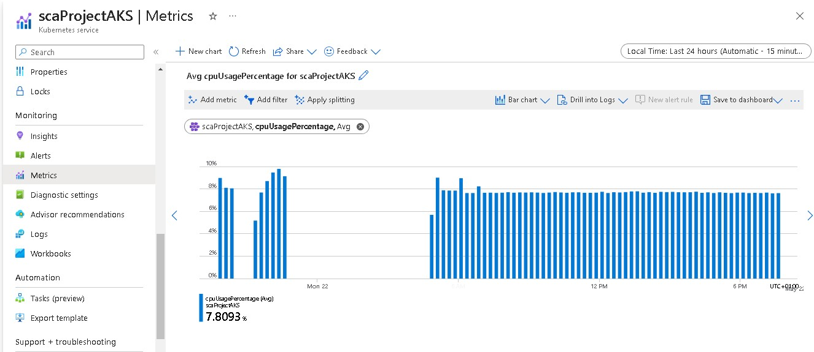
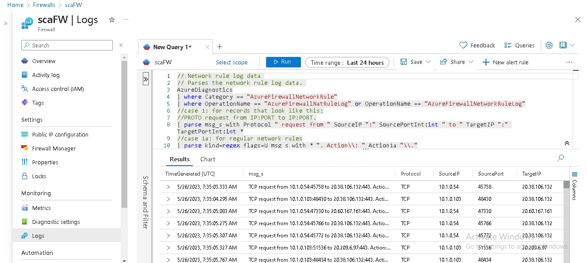

## Deployed a 3-tier application to a private Azure Kubernetes Service Cluster

Access the project [here](http://sca-project.uksouth.cloudapp.azure.com/) (It is no longer available)

- The source code and Dockerfiles can be found in the source-code directory. It was built with React, Node.js and Postgres

- The infrastructure directory contains the Terraform script for provisioning the infrastructure. 

- The infrastructure-addons directory contains an Ansible playbook to configure resources for the cluster. 

- The Kubernetes manifests can be found in infrastructure-addons/roles/deploy/templates/ directory

- The terraform-backend contains terraform scripts to configure a backend to store the terraform state files.

### Architectural Diagram


The project contains the following:
- Two Virtual networks that communicate with each other via Vnet peering
- A firewall and a virtual machine in the hub network. The firewall monitors incoming and outgoing traffic based on the DNAT, Network and Application rules defined. The virtual machine is used to access the private cluster and run commands on it.
- An internal ingress controller. The firewall sends the traffic to the ingress controller which in turn routes the traffic to the different services in the cluster.
- Azure key vault, Ansible vault, and Github Actions secrets are used for secrets management.
- Log analytics workspace is used to collect metrics and logs from the resources provisioned in the cluster
- A GitHub Actions CI/CD pipeline to automate the building, provisioning and deployment of the project


### To run the project locally:
- Install Azure CLI, Terraform, and Ansible
- Login to your Azure account and follow the prompts using
```
az login
```
- cd into terraform-backend/ directory and run ```terraform init```, `terraform plan`, and `terraform apply --auto-approve`  
This provisions the terraform backend to store the terraform state files
- cd into the infrastructure/ directory and repeat the terraform commands in the step above and pass your ssh public key as a variable when prompted. This provisions the private AKS cluster
- Finally, cd into the infrastructure-addons/ directory and run the following:
```
rm group_vars/all/vault
````
This removes the encrypted ansible vault file.

Set the variables prefixed in the vars.yml file in a new `vault` file and run
```
ansible-vault encrypt group_vars/all/vault
```
It prompts you to enter your password. This encrypts your sensitive values.

Lastly, run the ansible playbook with:
```
ansible-playbook main.yml --ask-vault-pass
```
This prompts you for the vault password you set earlier.


App:


Monitoring:




